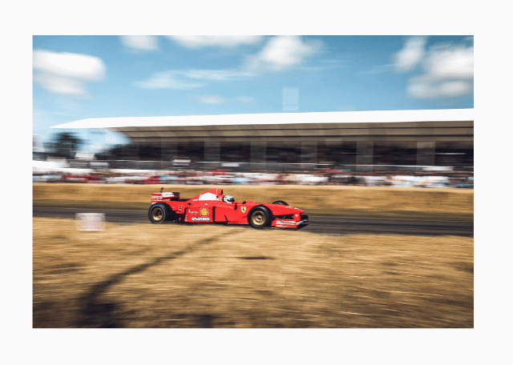

# Flutter: Image Loading placeholder

Something to show while image is downloading.

Image fades in once it has been loaded.

Implements custom loading placeholder and custom Fade In Animation (using AnimationController) to fade in the image.

The fade in/out transition time and the loading transition time are both customizable.

